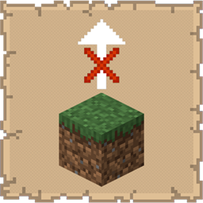

# No Item Bounce

  

   
A lightweight mod that removes the randomness from item drops when breaking blocks.

## Functionality

  

   
* **Centered Drops**: Items spawn at the exact center of the broken block (X.5, Z.5) instead of flying off in random horizontal directions
* **Vertical Control**: Optional toggle to remove the upward "pop" when items spawn
  - **Enabled (Default)**: Items appear instantly at floor level with zero upward velocity
  - **Disabled**: Items retain the vanilla upward bounce but stay centered on X/Z axes
* **Normal Float Animation**: Items still hover and bob normally after spawning

## Benefits

  

   
This mod is useful for players who:

- **Build Automated Farms**: Centered item drops make collection systems more reliable and easier to design
- **Prefer Precision**: Eliminate frustration from items bouncing into lava, off cliffs, or into unreachable corners
- **Value Predictability**: Know exactly where items will land when breaking blocks
- **Want Control**: Toggle vertical bounce based on preference - keep the vanilla feel or go fully static
- **Play Modpacks**: Lightweight and compatible - works alongside other mods without conflicts

Perfect for survival players, redstone engineers, and anyone tired of chasing scattered items!

## Installation

  

   
### Prerequisites
* **Minecraft:** 1.21.10
* **Loader:** [Fabric Loader](https://fabricmc.net/use/installer/) (>=0.18.4)
* **Core Dependencies:**
    * [Fabric API](https://modrinth.com/mod/fabric-api)
    * [Cloth Config API](https://modrinth.com/mod/cloth-config) (Required for configuration)
    * [Mod Menu](https://modrinth.com/mod/modmenu) (Recommended for configuration)

### Steps
1. Download the latest `.jar` from [Modrinth](https://modrinth.com/mod/no-item-bounce) or [CurseForge](https://www.curseforge.com/minecraft/mc-mods/no-item-bounce).
2. Move the file into your Minecraft `%appdata%/.minecraft/mods` folder.
3. Launch the game using the Fabric profile.

## Support

  

   
If you encounter bugs or wish to contribute:
* [Report any problems you find.](https://github.com/armaninyow/No-Item-Bounce/discussions/categories/issues)
* [Share your ideas for new features.](https://github.com/armaninyow/No-Item-Bounce/discussions/categories/suggestions)

## Credits

  

   
* **Author**: Armaninyow
* **License**: Released under [CC0-1.0](https://creativecommons.org/publicdomain/zero/1.0/).

