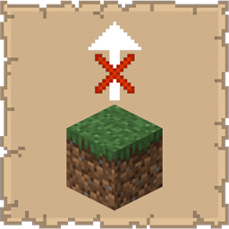

# No Item Bounce

## Installation

* [Modrinth](https://modrinth.com/mod/no-item-bounce)
* [CurseForge](https://www.curseforge.com/minecraft/mc-mods/no-item-bounce)

## Support
   
If you encounter bugs or wish to contribute:
* [Report any problems you find.](https://github.com/armaninyow/No-Item-Bounce/discussions/categories/issues)
* [Share your ideas for new features.](https://github.com/armaninyow/No-Item-Bounce/discussions/categories/suggestions)

## Changelog

  

   
### 3.1.1—1.21.x
* Added support for centering drops from falling blocks like gravel and sand
* Fixed non-storage blocks not having their item drops centered on break
* Fixed item drops bouncing upward on spawn when vertical bounce is disabled
* Fixed bamboo, sugar cane, and decaying leaves drops not being centered
### 3.1.0—1.21.x
* Added center item drops from all living entities (mobs and players) at their exact death position, with respect to the vertical bounce setting
### 3.0.0—1.21.x
* Added multi-version support covering Minecraft 1.21 through 1.21.11
### 2.0.0—1.21.11
* Updated to Minecraft 1.21.11
### 1.1.0—1.21.10
* Added storage block item centering where items dropped from storage blocks now spawn perfectly centered and can have vertical bounce removed
  * Supported blocks include:
    * Standard Storage: Chests (Regular, Trapped, Large, Ender), Barrels, Shulker Boxes
    * Processing: Furnaces (Regular, Blast, Smoker), Brewing Stands, Hoppers
    * Utility: Dispensers, Droppers, Jukeboxes, Lecterns, Chiseled Bookshelves
    * Decorative/Misc: Decorated Pots, Flower Pots, Campfires (Regular/Soul)
    * Entities: Armor Stands
  * Items only center when blocks are broken by players
  * All inventory items spawn at the block's center position (X.5, Y, Z.5)
  * Vertical bounce removal respects the existing config setting
* Persistent Configuration: Settings now save to `config/noitembounce.json` and persist between sessions
  * Default setting: Vertical bounce removal enabled
* Updated description to better explain the feature
* Changed "Remove Vertical Bounce: ON/OFF" to "Vertical Bounce: Enabled/Disabled" for clearer wording
* Fixed issue where mod settings would reset after restarting Minecraft
### 1.0.0—1.21.10
* Initial Release

